# Stock Research Agent - Project Details

## Project Overview
Stock Research Agent is a data-driven stock screening, ranking, and research platform built on PostgreSQL and Python. It maintains its own market data infrastructure for NSE (National Stock Exchange) equities, providing technical analysis, backtesting, portfolio management, and AI-assisted investment research capabilities.

---

## Project Structure & File Descriptions

### Root Level Files

#### `.env`
Environment configuration file for storing sensitive database credentials and API keys. Contains variables like DB_USER, DB_PASSWORD, DB_HOST, and DB_PORT that are loaded at runtime to securely configure database connections without hardcoding credentials.

#### `.git/`
Git version control directory. Tracks all project changes and maintains complete history for collaboration and version management.

#### `.venv/`
Python virtual environment directory containing all project dependencies and isolated Python packages. Ensures project dependencies don't conflict with system-wide packages.

#### `README.md`
Project documentation file that provides overview of the Stock Research Agent platform, including data layer status (NSE companies, listings, daily prices, indicators), current screening capabilities, and long-term vision for fundamental and technical analysis.

#### `requirements.txt`
Python dependencies file listing all required packages including pandas, sqlalchemy, yfinance, ta (technical analysis library), beautifulsoup4, and others needed for data ingestion, analysis, and portfolio management.

#### `next steps.txt`
Development notes tracking immediate and future work items for the project, used for planning and prioritization of features and improvements.

---

## Directory Structure & Contents

### `backtesting/` - Backtesting Framework & Analysis

This directory contains the backtesting framework used to validate trading strategies and screeners against historical data.

#### `__init__.py`
Python package initialization file for the backtesting module, enables imports from the backtesting directory.

#### `backtest_52wh.py`
Backtests the 52-week high screener strategy that identifies stocks trading near their 52-week highs. Evaluates portfolio performance over 90-day holding periods with configurable portfolio sizes, calculating returns and win rates across multiple rebalance dates.

#### `backtest_52wh_97_plus_momentum.py`
Tests a hybrid strategy combining 52-week high screener with momentum indicators. Filters 52-week high candidates to only those with strong momentum scores, aiming to improve entry point quality through multi-factor analysis.

#### `backtest_52wh_filter_comparison.py`
Compares different filtering approaches for the 52-week high strategy. Tests variations in filtering criteria and thresholds to identify which parameters produce optimal risk-adjusted returns.

#### `backtest_52wh_holding_periods.py`
Analyzes the impact of different holding period durations on 52-week high strategy performance. Tests holding periods ranging from 30 to 120 days to determine optimal exit timing.

#### `backtest_52wh_plus_uptrend.py`
Combines 52-week high screener with strong uptrend confirmation using moving average alignment (SMA20 > SMA50 > SMA200). Tests whether adding trend confirmation improves strategy performance and reduces drawdowns.

#### `backtest_52wh_portfolio_sizes.py`
Tests the 52-week high strategy across different portfolio sizes (5, 10, 20, 50 stocks). Analyzes how concentration levels affect return profile and risk metrics.

#### `backtest_52wh_thresholds.py`
Optimizes 52-week high screener parameters by testing different entry price thresholds relative to 52-week highs. Identifies optimal price levels for entry signals.

#### `backtest_golden_cross.py`
Backtests the golden cross strategy that identifies stocks where SMA50 crosses above SMA200. Evaluates strategy performance with 90-day holds across historical dates to measure profitability.

#### `backtest_investable_52wh.py`
Tests 52-week high strategy with investability filters applied, ensuring selected stocks meet minimum trading volume and liquidity requirements for practical execution.

#### `backtest_momentum.py`
Tests momentum-based screening strategy using momentum scores derived from 3-month and 6-month returns. Evaluates selecting top 20 momentum stocks with 90-day holding periods.

#### `backtest_strong_uptrend.py`
Backtests strong uptrend screener that identifies stocks with price above SMA20, SMA20 > SMA50, and SMA50 > SMA200. Tests strategy's effectiveness at capturing trending stocks.

#### `compare_screeners.py`
Compares performance across all screeners (52-week high, strong uptrend, momentum, golden cross). Consolidates backtest results showing average returns, win rates, and drawdowns for each strategy.

#### `generate_historical_portfolios.py`
Generates and saves historical portfolio compositions at each rebalance date for TOP10, TOP20, and TOP50 variants. Creates audit trail and enables portfolio performance analysis.

#### `generate_historical_rankings.py`
Generates historical rankings at each ranking date and saves to database. Creates comprehensive record of combined ranking scores over time.

#### `portfolio_backtest.py`
Tests complete portfolio strategy across multiple time periods with realistic portfolio construction. Calculates total returns, holding period performance, and overall strategy metrics.

#### `utils.py`
Utility functions for backtesting including functions to get rebalance dates, calculate exit dates, retrieve historical prices, and compute returns. Provides shared helpers for backtest scripts.

#### `TODO TOmmorow.txt`
Development status document tracking completed tasks (data layer, indicators, screeners, automation) and latest backtest results showing 28% average return with 91% win rate.

---

### `calculations/` - Technical Indicator Calculations

This directory handles computation and updating of technical indicators used in screening and analysis.

#### `backfill_momentum.py`
Backfills momentum indicators for entire historical price dataset when momentum scoring is added. Computes momentum scores retroactively for all available historical data.

#### `calculate_all_indicators.py`
Master calculation script that computes all technical indicators (SMA20, SMA50, SMA200, RSI14, momentum scores) for entire dataset. Used for initial data loading and periodic recalculation.

#### `calculate_indicators.py`
Calculates technical indicators for a single stock using the TA library. Computes moving averages (SMA20/50/200) and RSI14 indicators from price data.

#### `update_indicators.py`
Incrementally updates technical indicators for new daily prices. Fetches latest prices and recalculates indicators only for recent dates to optimize performance.

#### `update_momentum_indicators.py`
Specifically updates momentum indicators (return_3m, return_6m, momentum_score) for latest trading dates. Ensures momentum calculations stay current for daily screening.

---

### `daily_jobs/` - Daily Automation & Portfolio Management

This directory contains daily scheduled jobs for portfolio rebalancing and updates.

#### `__init__.py`
Python package initialization file for daily_jobs module, enables imports from the daily_jobs directory.

#### `full_portfolio_run.py`
Executes complete portfolio workflow including current position loading, order generation, and execution. Runs the full rebalancing cycle from analysis through order placement.

#### `rebalance_portfolio.py`
Orchestrates daily portfolio rebalancing process that generates orders from recommendation engine and executes them via paper executor. Main entry point for daily rebalancing job.

---

### `Data/` - Static Data Files

#### `nse_equity_list.csv`
CSV file containing master list of NSE stocks with company names, symbols, and ISIN numbers. Sourced from NSE and used to populate the companies and listings tables initially.

---

### `database/` - Database Configuration & Schema

This directory manages database connectivity and defines the data model.

#### `__init__.py`
Python package initialization file for database module, enables imports from the database directory.

#### `config.py`
Database configuration constants defining host, port, database name, username, and password for PostgreSQL connection.

#### `connection.py`
Creates SQLAlchemy database engine from environment variables. Establishes reusable database connection for all application modules to use.

#### `create_database.sql`
SQL script for initial database creation. Sets up PostgreSQL database and grants necessary permissions to the application user.

#### `daily_prices.sql`
SQL table definition for storing OHLCV (Open, High, Low, Close, Volume) daily price data with listing ID and trade date foreign keys.

#### `ingestion_runs.sql`
SQL table for tracking data ingestion process executions. Records when ingestion runs occur and helps identify data staleness.

#### `schema.sql`
Master SQL schema file containing complete database structure including all table definitions, relationships, indexes, and constraints.

#### `screener_results.sql`
SQL table definition for storing screening results. Tracks which stocks passed each screener on each date with rank position and score.

#### `seed.sql`
SQL initialization script that populates initial reference data and sets up the database with base records needed for operation.

#### `technical_indecators.sql`
SQL table definition for storing computed technical indicators (SMA20, SMA50, SMA200, RSI14, momentum scores) linked to daily prices.

#### `top_10_live_portfolio.sql`
SQL view or table definition for current TOP10 portfolio holdings. Provides quick access to current portfolio composition and positions.

---

### `execution/` - Order Execution & Broker Interface

This directory handles order execution and trading operations.

#### `__init__.py`
Python package initialization file for execution module, enables imports from the execution directory.

#### `broker_interface.py`
Abstract base class defining the broker interface contract with abstract buy() and sell() methods. Allows for multiple broker implementations (paper trading, live trading).

#### `cash_manager.py`
Manages cash position and available funds for trading. Tracks cash balance and ensures sufficient cash for pending trades.

#### `cost_models.py`
Calculates trading costs including brokerage fees (0.03%), STT tax (0.1%), and GST (18% on brokerage). Models realistic transaction costs for backtesting and performance attribution.

#### `paper_executor.py`
Implements paper trading executor inheriting from BrokerInterface. Currently prints buy/sell orders to console for testing purposes without executing real trades.

#### `transaction_costs.py`
Defines transaction cost percentages (brokerage, STT, GST) and provides calculate_cost() function to determine total trading costs for turnover amounts.

---

### `ingestion/` - Data Ingestion & Loading

This directory handles loading and updating market data from external sources.

#### `__init__.py`
Python package initialization file for ingestion module, enables imports from the ingestion directory.

#### `daily_price_update.py`
Fetches and stores daily price updates for all listed stocks. Downloads latest OHLCV data from yfinance and inserts into daily_prices table.

#### `load_all_daily_prices.py`
Loads complete historical price data for all stocks from yfinance. Used for initial data population covering multi-year history.

#### `load_daily_prices.py`
Loads historical prices for a specific stock or set of stocks. Provides granular control over which stocks are loaded and date ranges.

#### `load_nse_stocks.py`
Parses NSE equity list CSV and populates companies and listings tables. Handles duplicate detection and maintains referential integrity between entities.

---

### `jobs/` - Scheduled Jobs & Automation

This directory contains scheduled job runners for daily automation.

#### `daily_update.py`
Master daily job orchestrator that runs the complete daily workflow: price updates → indicator calculations → screening → ranking → portfolio generation. Executes all data refresh and analysis steps in sequence with timing metrics.

---

### `portfolio/` - Portfolio Management & Construction

This directory contains core portfolio management logic.

#### `__init__.py`
Python package initialization file for portfolio module, enables imports from the portfolio directory.

#### `accounting_engine.py`
Handles portfolio accounting including position tracking, cost basis management, and P&L calculations. Maintains accurate records of all transactions and valuations.

#### `benchmark_report.py`
Generates performance reports comparing portfolio returns against benchmarks. Provides attribution analysis and relative performance metrics.

#### `current_positions.py`
Loads current portfolio positions from database. Retrieves holdings, quantities, average costs, current prices, and market values for the active portfolio.

#### `order_generator.py`
Generates buy/sell orders by comparing current positions with target portfolio allocations. Determines which positions to increase, decrease, or close.

#### `performance_report.py`
Generates detailed performance reports showing returns, metrics, and analysis. Calculates and presents portfolio performance over various time periods.

#### `portfolio_backtest.py`
Tests complete portfolio strategy over historical periods. Simulates portfolio construction, holding, and rebalancing across time periods with performance metrics.

#### `portfolio_builder.py`
Constructs portfolios from screener rankings by assigning equal weights to top N stocks. Saves portfolio compositions to database with trade dates and rankings.

#### `position_sizer.py`
Calculates position sizes based on portfolio value and number of holdings. Typically assigns equal weight to each position but can implement other sizing schemes.

#### `pricing_engine.py`
Loads latest prices for portfolio positions. Retrieves current market prices to enable valuation and performance calculations.

#### `rebalance_engine.py`
Orchestrates portfolio rebalancing by checking for execution permission, generating orders, and recording rebalance history. Main engine coordinating rebalancing workflow.

#### `rebalance_guard.py`
Prevents duplicate rebalances and maintains rebalance history. Checks if portfolio has already been rebalanced on a date to avoid redundant execution.

#### `recommendation_engine.py`
Generates portfolio recommendations by loading current positions and target portfolio, comparing them to identify buy/sell orders. Core logic for determining required trades.

---

### `reports/` - Reports & Analysis Output

Currently empty directory reserved for report outputs and analysis results in future development.

---

### `screeners/` - Stock Screening Strategies

This directory contains different stock screening strategies for identifying investment candidates.

#### `combined_ranking.py`
Creates weighted composite ranking combining four screeners: momentum (35%), strong uptrend (30%), 52-week high (20%), and golden cross (15%). Produces overall ranking scores balancing different signals.

#### `fifty_two_week_high.py`
Identifies stocks trading near 52-week highs. Finds stocks where close price is within specified percentage of 52-week high, signaling strong momentum and breakout potential.

#### `golden_cross.py`
Detects golden cross signals where SMA50 crosses above SMA200. Indicates potential trend reversal and is considered a bullish technical signal by traders.

#### `momentum_scanner.py`
Ranks stocks by momentum score based on 3-month and 6-month returns. Selects top 100 momentum candidates and scores them for portfolio construction.

#### `run_all_screeners.py`
Orchestrates execution of all screening strategies in sequence. Runs momentum, strong uptrend, 52-week high, and golden cross screeners with timing metrics.

#### `strong_uptrend.py`
Identifies stocks in strong uptrends using moving average alignment: price > SMA20 > SMA50 > SMA200. Confirms trending moves across multiple time horizons.

---

## Key Technologies & Libraries

- **Database**: PostgreSQL with SQLAlchemy ORM
- **Data Processing**: Pandas, NumPy
- **Technical Analysis**: TA library (ta-lib alternative)
- **Data Source**: yfinance for market data
- **Python Version**: 3.x
- **Web Scraping**: BeautifulSoup4
- **Progress Tracking**: tqdm

---

## Data Flow Overview

1. **Data Ingestion**: NSE stocks loaded → Daily prices fetched from yfinance → Stored in database
2. **Indicator Calculation**: Technical indicators (SMA, RSI, momentum) calculated and updated daily
3. **Screening**: Multiple screeners evaluate stocks against different criteria
4. **Ranking**: Screener results combined with weighted composite ranking
5. **Portfolio Construction**: Top-ranked stocks selected and weighted for portfolio
6. **Execution**: Portfolio rebalancing orders generated and executed via paper executor
7. **Analysis**: Backtest results and performance metrics calculated and reported

---

## Main Workflows

### Daily Update Workflow
`jobs/daily_update.py` → Price Update → Indicator Calculation → All Screeners → Combined Ranking → Portfolio Generation

### Portfolio Rebalancing
`daily_jobs/rebalance_portfolio.py` → Load Current Positions → Generate Orders → Execute Orders → Update History

### Backtesting
Strategy Tests → Historical Data → Portfolio Simulation → Performance Metrics → Results Analysis

---

## Complete System Workflow - Code Flow Diagram

```mermaid
graph TD
    A["jobs/daily_update.py<br/>(Daily Job Orchestrator)"] --> B["ingestion/daily_price_update.py<br/>(Fetch Latest Prices)"]
    
    B --> C["yfinance API<br/>(Data Source)"]
    C --> D["database/connection.py<br/>(Store Prices)"]
    D --> E["daily_prices Table"]
    
    E --> F["calculations/update_indicators.py<br/>(Calculate Technical Indicators)"]
    F --> G["ta library<br/>(SMA20, SMA50, SMA200, RSI14)"]
    G --> H["technical_indicators Table"]
    
    H --> I["screeners/run_all_screeners.py<br/>(Run All Screeners)"]
    
    I --> J["screeners/momentum_scanner.py<br/>(Momentum Screening)"]
    I --> K["screeners/strong_uptrend.py<br/>(Uptrend Screening)"]
    I --> L["screeners/fifty_two_week_high.py<br/>(52-Week High Screening)"]
    I --> M["screeners/golden_cross.py<br/>(Golden Cross Screening)"]
    
    J --> N["screener_results Table"]
    K --> N
    L --> N
    M --> N
    
    N --> O["screeners/combined_ranking.py<br/>(Combine Rankings)"]
    O --> P["Weighted Composite Score<br/>Momentum 35% | Uptrend 30%<br/>52WH 20% | Golden 15%"]
    P --> Q["screener_results Table<br/>COMBINED_RANKING"]
    
    Q --> R["portfolio/portfolio_builder.py<br/>(Build Portfolios)"]
    R --> S["Generate TOP10, TOP20, TOP50"]
    S --> T["portfolios Table"]
    
    T --> U["Daily Update Complete ✓"]
    
    U -.->|Triggered by Scheduler| V["daily_jobs/rebalance_portfolio.py<br/>(Portfolio Rebalancing)"]
    
    V --> W["portfolio/recommendation_engine.py<br/>(Generate Orders)"]
    W --> X["portfolio/current_positions.py<br/>(Load Current Holdings)"]
    W --> Y["portfolio/position_sizer.py<br/>(Calculate Target Sizes)"]
    
    X --> Z["portfolio/order_generator.py<br/>(Compare Positions)"]
    Y --> Z
    
    Z --> AA["Generate BUY/SELL Orders"]
    AA --> AB["execution/paper_executor.py<br/>(Execute Orders)"]
    
    AB --> AC["execution/broker_interface.py<br/>(Order Interface)"]
    AC --> AD["Print Buy/Sell Orders"]
    
    AD --> AE["portfolio/rebalance_guard.py<br/>(Record History)"]
    AE --> AF["portfolio_rebalance_history Table"]
    
    AF --> AG["Rebalancing Complete ✓"]
    
    AG -.->|Performance Analysis| AH["backtesting/*.py<br/>(Backtest Strategies)"]
    
    AH --> AI["Load Historical Data"]
    AI --> AJ["Simulate Trades"]
    AJ --> AK["Calculate Returns"]
    AK --> AL["Generate Reports"]
    AL --> AM["compare_screeners.py<br/>(Compare Results)"]
    
    AM --> AN["Performance Metrics<br/>Returns | Win Rate | Drawdowns"]
    
    style A fill:#4CAF50,color:#fff
    style V fill:#2196F3,color:#fff
    style AH fill:#FF9800,color:#fff
    style U fill:#4CAF50,color:#fff
    style AG fill:#2196F3,color:#fff
    style AN fill:#FF9800,color:#fff
    style E fill:#9C27B0,color:#fff
    style H fill:#9C27B0,color:#fff
    style N fill:#9C27B0,color:#fff
    style Q fill:#9C27B0,color:#fff
    style T fill:#9C27B0,color:#fff
    style AF fill:#9C27B0,color:#fff
```



### Detailed Code Flow Explanation

#### Phase 1: Data Ingestion & Storage
1. **Daily Job Trigger** (`jobs/daily_update.py`)
   - Orchestrates the complete daily workflow
   - Measures execution time for each step
   
2. **Price Update** (`ingestion/daily_price_update.py`)
   - Fetches latest OHLCV data from yfinance for all listings
   - Stores in `daily_prices` table with trade date and listing ID
   - Handles incremental updates (only new dates)

#### Phase 2: Technical Analysis
3. **Indicator Calculation** (`calculations/update_indicators.py`)
   - Loads latest price data from database
   - Computes indicators using TA library:
     - Simple Moving Averages (SMA20, SMA50, SMA200)
     - Relative Strength Index (RSI14)
     - Momentum scores (3-month, 6-month returns)
   - Stores results in `technical_indicators` table

#### Phase 3: Stock Screening
4. **Multiple Screeners** (`screeners/run_all_screeners.py` orchestrates)
   - **Momentum Scanner**: Ranks by momentum scores, top 100
   - **Strong Uptrend**: Filters for price > SMA20 > SMA50 > SMA200
   - **52-Week High**: Identifies near 52-week highs
   - **Golden Cross**: Detects SMA50 crossing above SMA200
   
   All results stored in `screener_results` table

#### Phase 4: Ranking & Portfolio Construction
5. **Combined Ranking** (`screeners/combined_ranking.py`)
   - Weights each screener:
     - Momentum: 35%
     - Strong Uptrend: 30%
     - 52-Week High: 20%
     - Golden Cross: 15%
   - Generates composite ranking scores
   - Stores in `screener_results` with `COMBINED_RANKING` name

6. **Portfolio Building** (`portfolio/portfolio_builder.py`)
   - Loads top-ranked stocks
   - Creates TOP10, TOP20, TOP50 variants
   - Equal weights to each stock (e.g., TOP20 = 5% per stock)
   - Saves to `portfolios` table

#### Phase 5: Daily Update Complete
- All data refreshed and portfolios ready for trading

#### Phase 6: Portfolio Rebalancing
7. **Recommendation Engine** (`portfolio/recommendation_engine.py`)
   - Loads current positions from `portfolio_positions` table
   - Loads target portfolio from `portfolios` table
   - Compares actual vs. target allocations

8. **Order Generation** (`portfolio/order_generator.py`)
   - Calculates position sizing using current portfolio value
   - Generates BUY orders for underweight positions
   - Generates SELL orders for overweight/exited positions

9. **Order Execution** (`execution/paper_executor.py`)
   - Implements `BrokerInterface` abstract class
   - Currently prints orders to console (paper trading mode)
   - Can be extended for live broker connections

10. **Rebalance History** (`portfolio/rebalance_guard.py`)
    - Records rebalance in `portfolio_rebalance_history`
    - Prevents duplicate rebalances on same date
    - Maintains audit trail

#### Phase 7: Performance Analysis & Backtesting
11. **Backtesting** (`backtesting/*.py`)
    - Historical backtests validate strategy effectiveness
    - Tests each screener independently and combined
    - Varies parameters: holding periods, portfolio sizes, thresholds
    - Calculates returns, win rates, drawdowns

12. **Results Comparison** (`backtesting/compare_screeners.py`)
    - Aggregates backtest results
    - Compares performance across strategies
    - Identifies best performing strategies

### Database Schema Integration

```
Data Flow Through Database:
listings (Stock metadata)
    ↓
daily_prices (OHLCV data)
    ↓
technical_indicators (SMA, RSI, momentum)
    ↓
screener_results (Individual screener ranks)
    ↓
portfolios (Constructed portfolios)
    ↓
portfolio_positions (Current holdings)
    ↓
portfolio_rebalance_history (Execution log)
```

### Configuration & Scaling Points

- **Portfolio Variants**: TOP10, TOP20, TOP50 - easily extensible
- **Screener Weights**: Combined ranking weights configurable
- **Holding Periods**: Backtest varies 30-120 days
- **Rebalance Frequency**: Can be daily, weekly, monthly
- **Portfolio Value**: Position sizer scales based on portfolio value
- **Broker Implementation**: Paper executor can be swapped for live broker

---

